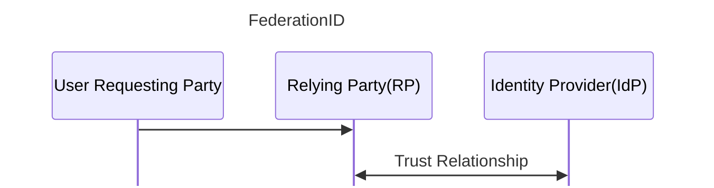

# CSSLP | ISC2

## Introduction
**CSSLP --> Certified Secure Software Lifecycle Professional** covers the main knowledge to create and manage the necessary process to build a secure development lifecycle of the software.

## Core Concepts

### CIA Triad

- **Confidentiality**: is the concept of preventing the disclosure of information to unauthotized parties. The identification of the authorized parties makes confidentiality linked to the concept of _authorization_. The technique employed to achieve confidentiality depends upon whether the data is at:
  - Rest &rarr; _Access Control_
  - Transit &rarr; _Encryption_
  - Use &rarr; _Access Control_

- **Integrity**: refers to preotecting data from unauthorized access. Protecting integrity can be done through the use of access control mechanisms. Individual specific levels of access with respect to read,write, and delete can be defined. If there is a requirement to verify the integrity of a data element throughout its lifecycle, the _criptographic function of hashing_ can be used. The singing through hash function proved that a item (data or code) is free of unauthorized modifications since singing. The addiction of _identity_ of the singing party helps other users determine _authenticity_.

- **Aviability**: is concerned with two issues: _ensuring system are available for authorized users_ when they require those systems and _denying acess to unauthorized users_ at all other times. Policy elements associated with determining access can be translated into the availability requirements. 

### Authentication & Authorization

- **Authentication**: is the process of determining the identity of a user. All process in a computer system have and identity assigned to them. Authentication deals with verifying the identity of a subject. _Authorization_ refers to the rules that determine what an individual can do on the computer system or network after being authenticated.
&nbsp;
  _**Methods of Authentication**_:
  -  Something you know
  -  Something you have (token)
  -  Something you are
  -  Something you do/act (typing patterns or gaits)
  -  Where are  you (phisical location) 
&nbsp;

  _**Multifactor Authentication**_: is simply the combination of two or more types of authentication.
&nbsp;

  _**Identity and Access Management**_: is the comprensive set of services related to managing the use of identities as part of an access control solution.
  &nbsp;
  
  _**Identity Lifecycles**_:
  -  _Provisioning_: involves the creation of a digital identity from an actual identity. The identity process binds some form of secret to the digital identity. pretecting the secret, yet making it usable, are foundational elements associated with the activity.
  -  _Managements_: chenges to identities, the addition and removal of roles, changes to rights and privileges associated with roles or identities
  -  _Deprovisioning_
  
   All of these items need to be done securely and logged appropriately.
   &nbsp;
   _**Identity Provider**_: is used to denote a system or service that creates, maintains, and manages identity information. IdP can range in scale and scope. From operating for a single system to operating across an enterprise. Additionally, they can be operated locally, distributed, or federated, depending on the specific solution. Multiple standards have been employed to achieve these services, including those built on the Security Assertion Markup Language (SAML), OpenID, and OAuth.
   &nbsp;
   _**Identity Attributes**_: are the specific characteristics of an identity: name,department,location,login ID,email,ecc... 

&nbsp;
**Authorization**: is the process of applying access control rules to a user process and determining whether can access an object.
&nbsp;

_**Subject-Object-Activity Model**_:
  -  Subject: the actor of the request (user,program,entity)
  -  Object: the item who user wants perform action on (file,system,database entry, resource)
  -  Activity: desired action that the subject wants to perform on object (CRUD, grant access to another user,ecc..)

_**Access Control Mechanisms**_: has been used to describe a variety if protection schemes. After an _Identity management System_ has verified the identity of a subject, _Access Control Mechanism_ regulate what the individual can actually do on the system. Different access control models are used based on the scale and scope of the elements of the subject-object-activity relationship.

### Accountability
Accounting is a mens of measuring activity. Accountability is the recording of actions and the subjects performing them. In IT systems, this can be done by _loggin_ crucial elements of activity as they occur. With respect to data elements, accounting is needed when activity is determined to be crucial to the degree that it may be audited at a later date and time. As a general rule, all critical transactions should be logged, including when they occured and which authorized user is associated with the event. Additional metadata that can support subsequent investigation of a problem is also frequently recorded.
&nbsp;
The information system security policy decomposition for auditing activities should consider both risk-based and organizational characteristics. The risk-based issues can be examined as cases of three forms of audit-related risk (_residual risk_)
  - **_Inherent Risk_**: are those associated with the process and its inherent error rate, assuming no internal controls exist to handle the potential errors.
  -  **_Detection Risk_**: is the risk that controls will not detect an issue that can result in matrial error.
  -  **_Control Risk_**: is the risk that controls will not detect or prevent material errors in a timely fashion.
  
 &nbsp;
 **_Organizational Characteristics_**: 
 -  Organizational History
 -  Business Environment
 -  Supervisory Issues

 &nbsp;
 **_Security Elements_**:
 -  Roles and Responsabilities
 -  Separation of Duties
 -  Training and Qualifications
 -  Change Management
 -  Control Management

 ### Logging 
 The challengess in designing log programs are what to log and where to store it. What needs to be logged is a function of several criteria. First, numerous compilance programs have logging requirements:
 -  HIPAA
 -  SOX
 -  PCI DSS
 -  EOC  

 **_Security Information and Event Management (SIEM)_**: 
 makes individual logs useful merging combination of events across other logs, detailing the activities of a particular user at a given point in time. These tools provide a rich analytical environment to sift through and find correlations in large datasets of security information.
 -  When we need that information.
 -  What information would be in that use case.

 A foundational element to consider when logging is the security of the information being logged.
&nbsp;
 **_Syslog_**: is an Internet Engineering Task Force (IETF) approved protocol for log messaging. It was designed and built around UNIX and provides a UNIX-centric format for sending log information across an internet Protocol (IP) network.

### OpenID vs OAuth

 **_OpenID_**: was created for federated authentication, specifically to allow a third party to authenticate your users for you by using accounts that users already have. The protocol enables websites or applications (consumer) to grant access to their own applications by using another service or application (provider) for authentication.
 
&nbsp;

&nbsp;
 **_OAuth_**: was created to eliminate the need for users to share their passwords with thid-party applications. The OAuth protocol enables websites or applications (consumers) to access protected resources from a web service (service provider) via an application programming interface (API), without requiring users to disclose their service provider credentials to the costumers.

 Both OpenID (authentication) and OAuth (authorization) accomplish many of the smae things. Each protocol provides a different set of features, which are required by their primary objective, but essentially, they are interchangable.

&nbsp;
_**Credential Management**_:
-  Credential Generation
-  Storage
-  Synchronization
-  Reset
-  Revocation

&nbsp;
_**NONREPUDIATION**_: is the concept for preventing a subject from denying a previous action with an object in a system. To ensure nonrepudiation the Authentication,Authorization & Auditing has to be properly configured.

## Security Design Principles

**_Good Enough Security_**
Every system has some appropriate level of required security; and it's important to determine this level early in the design process.
It's a trade-off between security and other aspects of a system.

**_Least Privilege_**
Least privilege means that a subject should have only the necessary rights and privileges to perform its current task with no additional rights and privileges. All programs, scripts, and batch files run inder the security context of specific user on an operating system.

**_Separation of Duties_**
Separation of Duties ensure that for any given task, more than one individual needs to be involved. the critical path of tasks is split into multiple items, which are then spread across more than a single party.

_**Defense in Depth**_ **&rarr;** **_Layered Security_**
For the layers to be diverse, they should be dissimilar in nature so that if an adversary makes it past one layer, another layer may still be affective in maintaining the system in a secure state. Defense in Depth provide security against many attack vector.

_**Fail-Safe**_
The Fail-Safe design principle is that when a system experiences a failure, it should fail to a safe state. One form of implementation is to use the concept of __explicit deny__. Any function that is not specifically authorized is denied by default.

_**Economy of Mechanism**_
The KISS (Keep-It-Simple-Stupid) principle tells us to eliminate those that we don't need. The general rule of thumb should be to always eliminate all nonessential services and protocol.

_**Complete Mediation**_
This principle states that when a sunject's authorization is verified with respect to an object and an actions, this verification occurs every time the subject requests access to an object.

_**Open Design**_
This principles state that the security of a system must be indipendent from the secrecy of the design. Like the modern criptographic alghoritms that the security depends upon the secrecy of the key instead of the secrecy of the alghoritm.

_**Least Common Mechanism**_
Refers to a design method designed to prevent inadvertent sharing of information. Instead of have a single procces that operates on a range of objects implement a specialized procces for all of them.
This principles create a conflict with the Leverage Existing Components principles. The designer must choose  the correct balance 
between the two.

_**Psychological Acceptability**_
Too much security could push the user to circumvent it to perform prohibited actions.

_**Weakest Link**_
A system can be considered only as strong as its weakest link.

_**Leverage Existing Components**_
Component reuse has many business advantages, including increases in efficency and security. This is a semplicistic form of reducing attack surface area. The downside of a massive reuse is associated with a monocolture environment, which is where a failure has a larger footprint.

_**Single Point of Failure**_
A single point of failure is any aspect of a system that, if it fails, means the entire system fails. It is imperative for a secure system to **NOT** have any single point of failure. The design of a software system should be such that all points of failure are analyzed and a single feature does not result in system failure.

### X.509 Certificates & PKI (Public Key Infrastructure)

-**X.509**: In cryptography, X.509 is an International Telecommunication Union (ITU) standard defining the format of public key certificates. An X.509 certificate binds an identity to a public key using a digital signature. A certificate contains an identity (a hostname, or an organization, or an individual) and a public key (RSA, DSA, ECDSA, ed25519, etc.), and is either signed by a certificate authority or is self-signed. When a certificate is signed by a trusted certificate authority, or validated by other means, someone holding that certificate can use the public key it contains to establish secure communications with another party, or validate documents digitally signed by the corresponding private key.

-**PKI - Public Key Infrastructure**: is a set of roles, policies, hardware, software and procedures needed to create, manage, distribute, use, store and revoke digital certificates and manage public-key encryption. 

A trusted pki is used to implement all the fundamental security goals: Confidentiality,Integrity,Authenticity and Non-Repudiation.

la signature è una cifratura (tramite private-key della CA) dell'hash del certificato

- **End-entities**: User or subject of X.509 certificate. Can be natural persons (e.g., Alice), legal persons (e.g., IBM), machines or applications and services (e.g., IoT devices, web servers)

- **Registration Authorities (RA)**: System delegated by a CA to perform identification of users applying for X.509 certificate. An RA is mostly accessed via user-friendly GUIs or APIs.

- **Certificate Authorities (CA)**: Collections of HW, SW, personnel and operating procedures delegated to create, issue, and revoke X.509 certificates

- **Repository**: System storing X.509 certificates and CRLs and providing means for access and distribution

openssl req x509 -newkey rsa:4096 -days 3650 -keuout RootCA.key -out RootCA.crt -subj '/C=CH/ST=Zurich/O=ExampleOrg/CN=ExampleOrg Root CA' -addext "keyUsage=cRLSign,keyCertSign"

openssl x509 --in RootCA.crt -text

openssl rsa -in RootCA.key -noout --text

Confidentiality --> Encription
Integrity --> Cripthographic Hash Function
Authenticity --> HMAC, Message authentication codes, authenticated encryption
Non-Repudiation --> Digital Signature

### Security Model

_**Access Control Model**_:
Access controls define what actions a subject can perform on specific objects. There are a variety of different access control models that emphasize different aspects of protection scheme.

- **ACL - Access Control List**: is a list that contains the subjects, but also the specific access that subject has for the object. Usually also the specific access that subject has for the object.
&nbsp;

-  **MAC - Mandatory Access Control**: restricts access based on the sensitivity of the information and whether the user has the authority to access that information. The owner or the subject CANNOT determine whether accesss is to be granted to another subject. It is the job of the S.O. This mechanism requiring that all objects and subjects relationships be defined before use in a system.
&nbsp;

-  **DAC - Discretionary Access Control**: A means of restricting access to objects based on the identity of subjects and/or groups to which they belong. The owner of an object can decide which other subjects may have access to the object and what specific access they may have.
&nbsp;

- **RBAC - Role-Based Access Control**: Users are associated with a set of roles. each role, in turn, is assigned with spicific persions on specific objects. Users will thus be granted permissions necessary to perform the tasks associated with them.
&nbsp;

- **RBAC#2 - Rule-Based Access Control**: Less common, a series of rules is contained in the access control list, and the determination of whether to grant access will be made based on these rules.
&nbsp;

-  **Access Control Matrix**: is a semplified form of access control notation where the allowed actions a subject is permitted with an object are listed in a matrix format.
&nbsp;

-  **Attribute-Based Access Control**: is a schema based on the use of attributes associated with an identity. These can use any type of attributes (user attributes, resource attributes, enviornment attributes) such as location, time, activityy being requested, ecc...
XACML - eXtensible Access Control Markup Language is a standard that implements attribute- and policy - based access control schemes.
&nbsp;

- **Bell-LaPadula Confidentiality Model**: is a confidentiality preserving model based on mandatory (MAC) and discrectionary (DAC) model. It has two principles:
&nbsp;
     - _**Simple Security Rule (no-read-up)**_: no subject can read information from an object with a security classification higher than that possesed by the subject itself.
     &nbsp;

     - _***property (no-write-down)**_: A subject can write to an object only if its security classification is less than or equal to the object's security classification.
&nbsp;

- **Take-Grant Model**: is buil upon graph theory. 
 &nbsp;

### Integrity Model
Integrity-based models are designed to protect the integrity of the information. For some types of information, integrity can be as importants as, or even more important than, confidentiality. Public information, such as stock prices, is available to all, but the correctness of their valuen is crucial, leading to the need to ensure integrity.

- **Biba Integrity Model**: integrity levels are used to separate permissions.
It has two principles:
     - **low-water-markup-policy (no-write-up)**: This policy prevents subjects from writing to objects of a higher integrity level. 
     - **integrity\* property (no-read-down)**: A subject cannot read an object at a lower integrity level.

