```mermaid
---
title: OpenID vs OAuth
config:
  mirrorActors: false
---
graph TB
    A(OpenID)
    B(OAuth)
    A -- Intersection --> C((A ∩ B))
    B -- Intersection --> C
```

# CSSLP---ISC2

## Introduction
CSSLP --> Certified Secure Software Lifecycle Professional covers the main knowledge to create and manage the necessary process to build a secure development lifecycle of the software.

## Core Concepts

### CIA Triad

- **Confidentiality**: is the concept of preventing the disclosure of information to unauthotized parties. The identification of the authorized parties makes confidentiality linked to the concept of _authorization_. The technique employed to achieve confidentiality depends upon whether the data is at:
  - Rest &rarr; _Access Control_
  - Transit &rarr; _Encryption_
  - Use &rarr; _Access Control_

- **Integrity**: refers to preotecting data from unauthorized access. Protecting integrity can be done through the use of access control mechanisms. Individual specific levels of access with respect to read,write, and delete can be defined. If there is a requirement to verify the integrity of a data element throughout its lifecycle, the _criptographic function of hashing_ can be used. The singing through hash function proved that a item (data or code) is free of unauthorized modifications since singing. The addiction of _identity_ of the singing party helps other users determine _authenticity_.

- **Aviability**: is concerned with two issues: _ensuring system are available for authorized users_ when they require those systems and _denying acess to unauthorized users_ at all other times. Policy elements associated with determining access can be translated into the availability requirements. 

### Authentication & Authorization

- **Authentication**: is the process of determining the identity of a user. All process in a computer system have and identity assigned to them. Authentication deals with verifying the identity of a subject. _Authorization_ refers to the rules that determine what an individual can do on the computer system or network after being authenticated.
&nbsp;
  _Methods of Authentication_:
  -  Something you know
  -  Something you have (token)
  -  Something you are
  -  Something you do/act (typing patterns or gaits)
  -  Where are  you (phisical location) 
&nbsp;

  _Multifactor Authentication_: is simply the combination of two or more types of authentication.
&nbsp;

  _Identity and Access Management_: is the comprensive set of services related to managing the use of identities as part of an access control solution.
  &nbsp;
  
  _Identity Lifecycles_:
  -  Provisioning: involves the creation of a digital identity from an actual identity. The identity process binds some form of secret to the digital identity. pretecting the secret, yet making it usable, are foundational elements associated with the activity.
  -  Managements: chenges to identities, the addition and removal of roles, changes to rights and privileges associated with roles or identities
  -  Deprovisioning
  
   All of these items need to be done securely and logged appropriately.
   &nbsp;
   _Identity Provider_: is used to denote a system or service that creates, maintains, and manages identity information. IdP can range in scale and scope. From operating for a single system to operating across an enterprise. Additionally, they can be operated locally, distributed, or federated, depending on the specific solution. Multiple standards have been employed to achieve these services, including those built on the Security Assertion Markup Language (SAML), OpenID, and OAuth.
   &nbsp;
   _Identity Attributes_: are the specific characteristics of an identity: name,department,location,login ID,email,ecc... 

  &nbsp;
- **Authorization**: is the process of applying access control rules to a user process and determining whether can access an object.
&nbsp;
_Subject-Object-Activity Model_:
  -  Subject: the actor of the request (user,program,entity)
  -  Object: the item who user wants perform action on (file,system,database entry, resource)
  -  Activity: desired action that the subject wants to perform on object (CRUD, grant access to another user,ecc..)

_Access Control Mechanisms_: has been used to describe a variety if protection schemes. After an _Identity management System_ has verified the identity of a subject, _Access Control Mechanism_ regulate what the individual can actually do on the system. Different access control models are used based on the scale and scope of the elements of the subject-object-activity relationship.

### Accountability
Accounting is a mens of measuring activity. Accountability is the recording of actions and the subjects performing them. In IT systems, this can be done by _loggin_ crucial elements of activity as they occur. With respect to data elements, accounting is needed when activity is determined to be crucial to the degree that it may be audited at a later date and time. As a general rule, all critical transactions should be logged, including when they occured and which authorized user is associated with the event. Additional metadata that can support subsequent investigation of a problem is also frequently recorded.
&nbsp;
The information system security policy decomposition for auditing activities should consider both risk-based and organizational characteristics. The risk-based issues can be examined as cases of three forms of audit-related risk (_residual risk_)
  - _Inherent Risk_: are those associated with the process and its inherent error rate, assuming no internal controls exist to handle the potential errors.
  -  _Detection Risk_: is the risk that controls will not detect an issue that can result in matrial error.
  -  _Control Risk_: is the risk that controls will not detect or prevent material errors in a timely fashion.
  
 &nbsp;
 _Organizational Characteristics_: 
 -  Organizational History
 -  Business Environment
 -  Supervisory Issues

 &nbsp;
 _Security Elements_:
 -  Roles and Responsabilities
 -  Separation of Duties
 -  Training and Qualifications
 -  Change Management
 -  Control Management

 &nbsp;
 ### Logging 
 The challengess in designing log programs are what to log and where to store it. What needs to be logged is a function of several criteria. First, numerous compilance programs have logging requirements:
 -  HIPAA
 -  SOX
 -  PCI DSS
 -  EOC  
 &nbsp;

 _Security Information and Event Management (SIEM)_: 
 makes individual logs useful merging combination of events across other logs, detailing the activities of a particular user at a given point in time. These tools provide a rich analytical environment to sift through and find correlations in large datasets of security information.
 -  When we need that information.
 -  What information would be in that use case.

&nbsp;
 A foundational element to consider when logging is the security of the information being logged.
&nbsp;
 _Syslog_: is an Internet Engineering Task Force (IETF) approved protocol for log messaging. It was designed and built around UNIX and provides a UNIX-centric format for sending log information across an internet Protocol (IP) network.

## OpenID vs OAuth

 _OpenID_: was created for federated authentication, specifically to allow a third party to authenticate your users for you by using accounts that users already have. The protocol enables websites or applications (consumer) to grant access to their own applications by using another service or application (provider) for authentication.
 
&nbsp;

&nbsp;
 _OAuth_: was created to eliminate the need for users to share their passwords with thid-party applications. The OAuth protocol enables websites or applications (consumers) to access protected resources from a web service (service provider) via an application programming interface (API), without requiring users to disclose their service provider credentials to the costumers.
 &nbsp;

 Both OpenID (authentication) and OAuth (authorization) accomplish many of the smae things. Each protocol provides a different set of features, which are required by their primary objective, but essentially, they are interchangable.

&nbsp;

  

